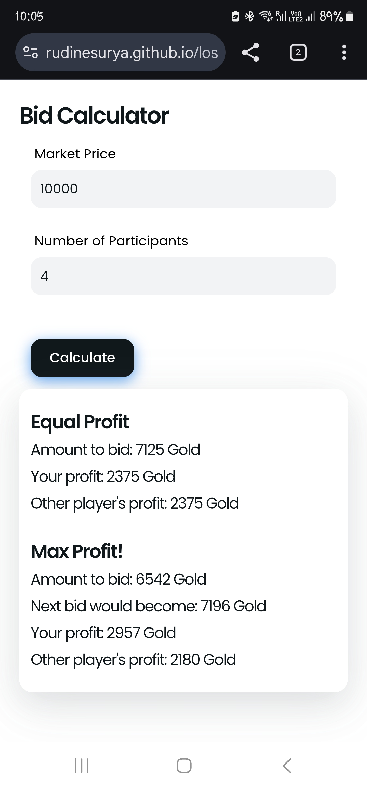

A Bid Calculator in Lost Ark is a tool or a resource that helps players estimate the optimal bid price for items or gear in the game's Auction House or during events like the Auction House Bidding System. This calculator typically focuses on calculating the bid for a specific item based on its market value, rarity, demand, and other in-game mechanics.

Here’s a breakdown of how a Bid Calculator in Lost Ark works:

Bid Optimization:
- The calculator may provide suggestions for the most efficient bidding strategy, helping you avoid overbidding or underbidding on an item.
- This ensures you don't waste valuable in-game currency while also increasing your chances of winning the auction.

 
 

